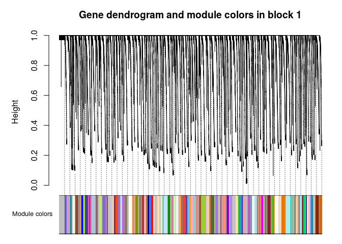
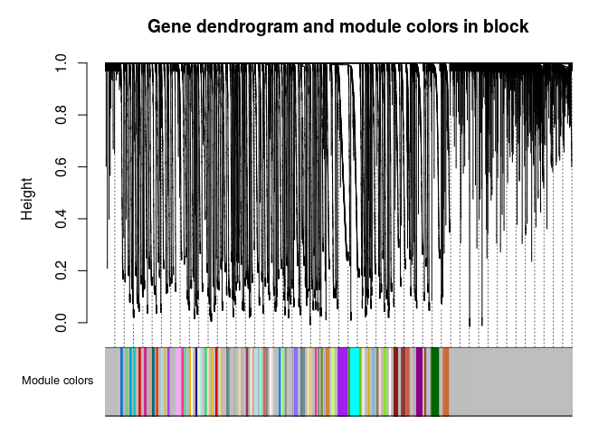
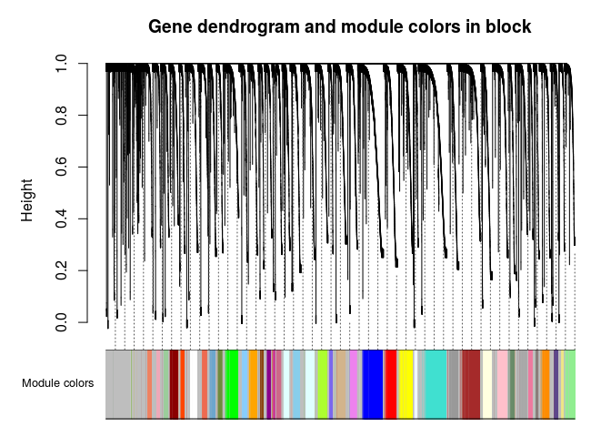
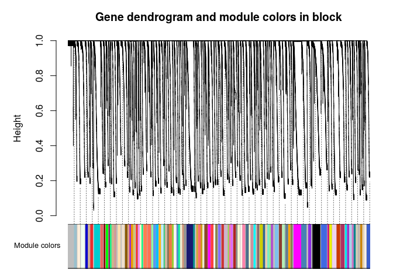
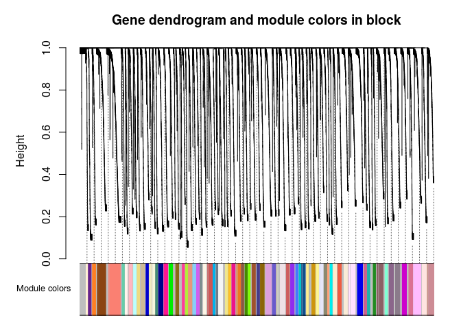

```r
library(glue)
library(fs)
library(rprojroot)
library(tidyverse)
library(seuratTools)
library(WGCNA)
enableWGCNAThreads()
```

```
## Allowing parallel execution with up to 7 working processes.
```

```r
library(cluster)
# library(here)
proj_dir = rprojroot::find_root(criterion = has_file_pattern("*.Rproj"))
```

# load seurat object


```r
seu <- load_seurat_from_proj(proj_dir)
```

# 02 load data from file


```r
datTraits=seu$gene[[]]
rownames(datTraits) <- stringr::str_replace_all(rownames(datTraits), "-", ".")
datTraits$sample_id <- stringr::str_replace_all(datTraits$sample_id, "-", ".")

datExpression=GetAssayData(seu$gene, "counts")
```


```r
# This vector contains the cell names
sample_id= names(data.frame(datExpression[,-1]))
 # This vector contains the gene names
GeneName= rownames(datExpression)

# We transpose the data so that the rows correspond to samples and the columns correspond to genes
# Since the first column contains the gene names, we exclude it.
datExpr=data.frame(t(as.matrix(datExpression)))
names(datExpr)=datExpression[,1]
dimnames(datExpr)[[1]]=names(data.frame(datExpression))
```


```r
# First, make sure that the array names in the file datTraits line up with those in the microarray data 
table( dimnames(datExpr)[[1]]==datTraits$sample_id)
```

```
## 
## TRUE 
##  572
```

```r
# Next, define the microarray sample trait 
y=datTraits$custom_cluster
```

# 03 data processing


```r
meanExpressionByCell=apply( datExpr,1,mean, na.rm=T)  
NumberMissingByCell=apply( is.na(data.frame(datExpr)),1, sum)
```


```r
sizeGrWindow(9, 5)
barplot(meanExpressionByCell,
        xlab = "Sample", ylab = "Mean expression",
        main ="Mean expression across samples",
        names.arg = names(meanExpressionByCell), cex.names = 0.7)
```


```
## KeepCell
## TRUE 
##  572
```

```
##   [1] "shl20171031.002" "shl20171031.003" "shl20171031.004" "shl20171031.005"
##   [5] "shl20171031.006" "shl20171031.007" "shl20171031.008" "shl20171031.009"
##   [9] "shl20171031.010" "shl20171031.011" "shl20171031.012" "shl20171031.013"
##  [13] "shl20171031.014" "shl20171031.015" "shl20171031.016" "shl20171031.017"
##  [17] "shl20171031.018" "shl20171031.019" "shl20171031.020" "shl20171031.021"
##  [21] "shl20171031.022" "shl20171031.023" "shl20171031.024" "shl20171031.025"
##  [25] "shl20171031.026" "shl20171031.027" "shl20171031.028" "shl20171031.029"
##  [29] "shl20171031.030" "shl20171031.031" "shl20171031.032" "shl20171031.033"
##  [33] "shl20171031.034" "shl20171031.035" "shl20171031.036" "shl20171031.037"
##  [37] "shl20171031.038" "shl20171031.039" "shl20171031.040" "shl20171031.041"
##  [41] "shl20171031.042" "shl20171031.043" "shl20171031.044" "shl20171031.045"
##  [45] "shl20171031.046" "shl20171031.047" "shl20171031.048" "shl20171031.049"
##  [49] "shl20171031.050" "shl20171031.051" "shl20171031.052" "shl20171031.053"
##  [53] "shl20171031.054" "shl20171031.055" "shl20171031.056" "shl20171031.057"
##  [57] "shl20171031.058" "shl20171031.059" "shl20171031.060" "shl20171031.061"
##  [61] "shl20171031.062" "shl20171031.063" "shl20171031.064" "shl20171031.065"
##  [65] "shl20171031.066" "shl20171031.067" "shl20171031.068" "shl20171031.069"
##  [69] "shl20171031.070" "shl20171031.071" "shl20171031.072" "shl20171031.073"
##  [73] "shl20171031.074" "shl20171031.075" "shl20171031.076" "shl20171031.077"
##  [77] "shl20171031.078" "shl20171031.079" "shl20171031.080" "shl20171031.081"
##  [81] "shl20171031.082" "shl20171031.083" "shl20171031.084" "shl20171031.085"
##  [85] "shl20171031.086" "shl20171031.087" "shl20171031.088" "shl20171031.089"
##  [89] "shl20171031.090" "shl20171031.091" "shl20171031.092" "shl20171031.093"
##  [93] "shl20171031.094" "shl20171031.095" "shl20171031.096" "shl20171031.097"
##  [97] "shl20171031.098" "shl20171031.099" "shl20171031.100" "shl20171031.101"
## [101] "shl20171031.102" "shl20171031.103" "shl20171031.104" "shl20171031.105"
## [105] "shl20171031.106" "shl20171031.107" "shl20171031.108" "shl20171031.109"
## [109] "shl20171031.110" "shl20171031.111" "shl20171031.112" "shl20171031.113"
## [113] "shl20171031.114" "shl20171031.115" "shl20171031.116" "shl20171031.117"
## [117] "shl20171031.118" "shl20171031.119" "shl20171031.120" "shl20171031.121"
## [121] "shl20171031.122" "shl20171031.123" "shl20171031.124" "shl20171031.125"
## [125] "shl20171031.126" "shl20171031.127" "shl20171031.128" "shl20171031.129"
## [129] "shl20171031.130" "shl20171031.131" "shl20171031.132" "shl20171031.133"
## [133] "shl20171031.134" "shl20171031.135" "shl20171031.136" "shl20171031.137"
## [137] "shl20171031.138" "shl20171031.139" "shl20171031.140" "shl20171031.141"
## [141] "shl20171031.142" "shl20171031.143" "shl20171031.144" "shl20171031.145"
## [145] "shl20171031.146" "shl20171031.147" "shl20171031.148" "shl20171031.149"
## [149] "shl20171031.150" "shl20171031.151" "shl20171031.152" "shl20171031.153"
## [153] "shl20171031.154" "shl20171031.155" "shl20171031.156" "shl20171031.157"
## [157] "shl20171031.158" "shl20171031.159" "shl20171031.160" "shl20171031.161"
## [161] "shl20171031.162" "shl20171031.163" "shl20171031.164" "shl20171031.165"
## [165] "shl20171031.166" "shl20171031.167" "shl20171031.168" "shl20171031.169"
## [169] "shl20171031.170" "shl20171031.171" "shl20171031.172" "shl20171031.173"
## [173] "shl20171031.174" "shl20171031.175" "shl20171031.176" "shl20171031.177"
## [177] "shl20171031.178" "shl20171031.179" "shl20171031.180" "shl20171031.181"
## [181] "shl20171031.182" "shl20171031.183" "shl20171031.184" "shl20171031.185"
## [185] "shl20171031.186" "shl20171031.187" "shl20171031.188" "shl20171031.189"
## [189] "shl20171031.190" "shl20171031.191" "shl20171031.192" "shl20171031.193"
## [193] "shl20171031.194" "shl20171031.195" "shl20171031.196" "shl20171031.197"
## [197] "shl20171031.198" "shl20171031.199" "shl20171031.200" "shl20171031.201"
## [201] "shl20171031.202" "shl20171031.203" "shl20171031.204" "shl20171031.205"
## [205] "shl20171031.206" "shl20171031.207" "shl20171031.208" "shl20171031.209"
## [209] "shl20171031.210" "shl20171031.211" "shl20171031.212" "shl20171031.213"
## [213] "shl20171031.214" "shl20171031.215" "shl20171031.216" "shl20171031.217"
## [217] "shl20171031.218" "shl20171031.219" "shl20171031.220" "shl20171031.221"
## [221] "shl20171031.222" "shl20171031.223" "shl20171031.224" "shl20171031.225"
## [225] "shl20171031.226" "shl20171031.227" "shl20171031.228" "shl20171031.229"
## [229] "shl20171031.230" "shl20171031.231" "shl20171031.232" "shl20171031.233"
## [233] "shl20171031.234" "shl20171031.235" "shl20171031.236" "shl20171031.237"
## [237] "shl20171031.238" "shl20171031.239" "shl20171031.240" "shl20171031.241"
## [241] "shl20171031.242" "shl20171031.243" "shl20171031.244" "shl20171031.245"
## [245] "shl20171031.246" "shl20171031.247" "shl20171031.248" "shl20171031.249"
## [249] "shl20171031.250" "shl20171031.251" "shl20171031.252" "shl20171031.253"
## [253] "shl20171031.254" "shl20171031.255" "shl20171031.256" "shl20171031.257"
## [257] "shl20171031.258" "shl20171031.259" "shl20171031.260" "shl20171031.261"
## [261] "shl20171031.262" "shl20171031.263" "shl20171031.264" "shl20171031.265"
## [265] "shl20171031.266" "shl20171031.267" "shl20171031.268" "shl20171031.269"
## [269] "shl20171031.270" "shl20171031.271" "shl20171031.272" "shl20171031.273"
## [273] "shl20171031.274" "shl20171031.275" "shl20171031.276" "shl20171031.277"
## [277] "shl20171031.278" "shl20171031.279" "shl20171031.280" "shl20171031.281"
## [281] "shl20171031.282" "shl20171031.283" "shl20171031.284" "shl20171031.285"
## [285] "shl20171031.286" "shl20171031.287" "shl20171031.288" "shl20171031.289"
## [289] "shl20171031.290" "shl20171031.291" "shl20171031.292" "shl20171031.293"
## [293] "shl20171031.294" "shl20171031.295" "shl20171031.296" "shl20171031.297"
## [297] "shl20171031.298" "shl20171031.299" "shl20171031.300" "shl20171031.301"
## [301] "shl20171031.302" "shl20171031.303" "shl20171031.304" "shl20171031.305"
## [305] "shl20171031.306" "shl20171031.307" "shl20171031.308" "shl20171031.309"
## [309] "shl20171031.310" "shl20171031.311" "shl20171031.312" "shl20171031.313"
## [313] "shl20171031.314" "shl20171031.315" "shl20171031.316" "shl20171031.317"
## [317] "shl20171031.318" "shl20171031.319" "shl20171031.320" "shl20171031.321"
## [321] "shl20171031.322" "shl20171031.323" "shl20171031.324" "shl20171031.325"
## [325] "shl20171031.326" "shl20171031.327" "shl20171031.328" "shl20171031.329"
## [329] "shl20171031.330" "shl20171031.331" "shl20171031.332" "shl20171031.333"
## [333] "shl20171031.334" "shl20171031.335" "shl20171031.336" "shl20171031.337"
## [337] "shl20171031.338" "shl20171031.339" "shl20171031.340" "shl20171031.341"
## [341] "shl20171031.342" "shl20171031.343" "shl20171031.344" "shl20171031.345"
## [345] "shl20171031.346" "shl20171031.347" "shl20171031.348" "shl20171031.349"
## [349] "shl20171031.350" "shl20171031.351" "shl20171031.352" "shl20171031.353"
## [353] "shl20171031.354" "shl20171031.355" "shl20171031.356" "shl20171031.357"
## [357] "shl20171031.358" "shl20171031.359" "shl20171031.360" "shl20171031.361"
## [361] "shl20171031.362" "shl20171031.363" "shl20171031.364" "shl20171031.365"
## [365] "shl20171031.366" "shl20171031.367" "shl20171031.368" "shl20171031.369"
## [369] "shl20171031.370" "shl20171031.371" "shl20171031.372" "shl20171031.373"
## [373] "shl20171031.374" "shl20171031.375" "shl20171031.376" "shl20171031.377"
## [377] "shl20171031.378" "shl20171031.379" "shl20171031.380" "shl20171031.381"
## [381] "shl20171031.382" "shl20171031.383" "shl20171031.384" "shl20171031.385"
## [385] "shl20171031.386" "shl20171031.387" "shl20171031.388" "shl20171031.389"
## [389] "shl20171031.390" "shl20171031.391" "shl20171031.392" "shl20171031.393"
## [393] "shl20171031.394" "shl20171031.395" "shl20171031.396" "shl20171031.397"
## [397] "shl20171031.398" "shl20171031.399" "shl20171031.400" "shl20171031.401"
## [401] "shl20171031.402" "shl20171031.403" "shl20171031.404" "shl20171031.405"
## [405] "shl20171031.406" "shl20171031.407" "shl20171031.408" "shl20171031.409"
## [409] "shl20171031.410" "shl20171031.411" "shl20171031.412" "shl20171031.413"
## [413] "shl20171031.414" "shl20171031.415" "shl20171031.416" "shl20171031.417"
## [417] "shl20171031.418" "shl20171031.419" "shl20171031.420" "shl20171031.421"
## [421] "shl20171031.422" "shl20171031.423" "shl20171031.424" "shl20171031.425"
## [425] "shl20171031.426" "shl20171031.427" "shl20171031.428" "shl20171031.429"
## [429] "shl20171031.430" "shl20171031.431" "shl20171031.432" "shl20171031.433"
## [433] "shl20171031.434" "shl20171031.435" "shl20171031.436" "shl20171031.437"
## [437] "shl20171031.438" "shl20171031.439" "shl20171031.440" "shl20171031.441"
## [441] "shl20171031.442" "shl20171031.443" "shl20171031.444" "shl20171031.445"
## [445] "shl20171031.446" "shl20171031.447" "shl20171031.448" "shl20171031.449"
## [449] "shl20171031.450" "shl20171031.451" "shl20171031.452" "shl20171031.453"
## [453] "shl20171031.454" "shl20171031.455" "shl20171031.456" "shl20171031.457"
## [457] "shl20171031.458" "shl20171031.459" "shl20171031.460" "shl20171031.461"
## [461] "shl20171031.462" "shl20171031.463" "shl20171031.464" "shl20171031.465"
## [465] "shl20171031.466" "shl20171031.467" "shl20171031.468" "shl20171031.469"
## [469] "shl20171031.470" "shl20171031.471" "shl20171031.472" "shl20171031.473"
## [473] "shl20171031.474" "shl20171031.475" "shl20171031.476" "shl20171031.477"
## [477] "shl20171031.478" "shl20171031.479" "shl20171031.480" "shl20171031.481"
## [481] "shl20171031.482" "shl20171031.483" "shl20171031.484" "shl20171031.485"
## [485] "shl20171031.486" "shl20171031.487" "shl20171031.488" "shl20171031.489"
## [489] "shl20171031.490" "shl20171031.491" "shl20171031.492" "shl20171031.493"
## [493] "shl20171031.494" "shl20171031.495" "shl20171031.496" "shl20171031.497"
## [497] "shl20171031.498" "shl20171031.499" "shl20171031.500" "shl20171031.501"
## [501] "shl20171031.502" "shl20171031.503" "shl20171031.504" "shl20171031.505"
## [505] "shl20171031.506" "shl20171031.507" "shl20171031.508" "shl20171031.509"
## [509] "shl20171031.510" "shl20171031.511" "shl20171031.512" "shl20171031.513"
## [513] "shl20171031.514" "shl20171031.515" "shl20171031.516" "shl20171031.517"
## [517] "shl20171031.518" "shl20171031.519" "shl20171031.520" "shl20171031.521"
## [521] "shl20171031.522" "shl20171031.523" "shl20171031.524" "shl20171031.525"
## [525] "shl20171031.526" "shl20171031.527" "shl20171031.528" "shl20171031.529"
## [529] "shl20171031.530" "shl20171031.531" "shl20171031.532" "shl20171031.533"
## [533] "shl20171031.534" "shl20171031.535" "shl20171031.536" "shl20171031.537"
## [537] "shl20171031.538" "shl20171031.539" "shl20171031.540" "shl20171031.541"
## [541] "shl20171031.542" "shl20171031.543" "shl20171031.544" "shl20171031.545"
## [545] "shl20171031.546" "shl20171031.547" "shl20171031.548" "shl20171031.549"
## [549] "shl20171031.550" "shl20171031.551" "shl20171031.552" "shl20171031.553"
## [553] "shl20171031.554" "shl20171031.555" "shl20171031.556" "shl20171031.557"
## [557] "shl20171031.558" "shl20171031.559" "shl20171031.560" "shl20171031.561"
## [561] "shl20171031.562" "shl20171031.563" "shl20171031.564" "shl20171031.565"
## [565] "shl20171031.566" "shl20171031.567" "shl20171031.568" "shl20171031.569"
## [569] "shl20171031.570" "shl20171031.571" "shl20171031.572" NA
```


```r
NumberMissingByGene =apply( is.na(data.frame(datExpr)),2, sum)
# One could do a barplot(NumberMissingByGene), but the barplot is empty in this case.
# It may be better to look at the numbers of missing samples using the summary method:
summary(NumberMissingByGene)
```

```
##    Min. 1st Qu.  Median    Mean 3rd Qu.    Max. 
##       0       0       0       0       0       0
```

```r
# Calculate the variances of the probes and the number of present entries
variancedatExpr=as.vector(apply(as.matrix(datExpr),2,var, na.rm=T))
no.presentdatExpr=as.vector(apply(!is.na(as.matrix(datExpr)),2, sum) )
# Another way of summarizing the number of pressent entries
table(no.presentdatExpr)
```

```
## no.presentdatExpr
##   572 
## 56267
```

```r
# Keep only genes whose variance is non-zero and have at least 4 present entries
KeepGenes= variancedatExpr>0 & no.presentdatExpr>=4
table(KeepGenes)
```

```
## KeepGenes
## FALSE  TRUE 
## 11467 44800
```


```r
datExpr=datExpr[, KeepGenes]
GeneName=GeneName[KeepGenes]
```


```r
sizeGrWindow(9, 5)
plotClusterTreeSamples(datExpr=datExpr, y=y)
```

# 04 gene screening


```r
GS1= as.numeric(cor(y, datExpr, use="p"))
# Network terminology: GS1 will be referred to as signed gene significance measure
p.Standard=corPvalueFisher(GS1, nSamples =length(y) )
# since the q-value function has problems with missing data, we use the following trick
p.Standard2=p.Standard
p.Standard2[is.na(p.Standard)]=1
q.Standard=qvalue(p.Standard2)$qvalues
# Form a data frame to hold the results
StandardGeneScreeningResults=data.frame(GeneName,PearsonCorrelation=GS1, p.Standard, q.Standard)
```


```r
table(q.Standard<.20)
```

```
## 
## FALSE 
## 44800
```


# 05a blockwise constructin of WGCN and modules


```r
net <- blockwiseModules(datExpr, power = 6,
                       maxBlockSize = 10000,
                       TOMType = "unsigned", minModuleSize = 35,
                       reassignThreshold = 0, mergeCutHeight = 0.45,
                       numericLabels = TRUE, pamRespectsDendro = FALSE,
                       saveTOMs = TRUE,
                       saveTOMFileBase = "shlTOM", 
                       loadTOM = TRUE,
                       verbose = 3)
```

```
##  Calculating module eigengenes block-wise from all genes
##    Flagging genes and samples with too many missing values...
##     ..step 1
##   ..Excluding 1 genes from the calculation due to too many missing samples or zero variance.
##     ..step 2
##  ....pre-clustering genes to determine blocks..
##    Projective K-means:
##    ..k-means clustering..
##    ..merging smaller clusters...
## Block sizes:
## gBlocks
##    1    2    3    4    5 
## 9993 9992 9973 8857 5984 
##  ..Working on block 1 .
##    ..loading TOM for block 1 from file shlTOM-block.1.RData
##  ....clustering..
##  ....detecting modules..
##  ....calculating module eigengenes..
##  ....checking kME in modules..
##      ..removing 30 genes from module 1 because their KME is too low.
##      ..removing 13 genes from module 2 because their KME is too low.
##      ..removing 15 genes from module 4 because their KME is too low.
##      ..removing 2 genes from module 6 because their KME is too low.
##      ..removing 15 genes from module 9 because their KME is too low.
##      ..removing 10 genes from module 10 because their KME is too low.
##      ..removing 20 genes from module 15 because their KME is too low.
##      ..removing 20 genes from module 19 because their KME is too low.
##      ..removing 3 genes from module 23 because their KME is too low.
##      ..removing 3 genes from module 24 because their KME is too low.
##      ..removing 7 genes from module 25 because their KME is too low.
##      ..removing 11 genes from module 27 because their KME is too low.
##      ..removing 2 genes from module 28 because their KME is too low.
##      ..removing 14 genes from module 30 because their KME is too low.
##      ..removing 9 genes from module 31 because their KME is too low.
##      ..removing 3 genes from module 32 because their KME is too low.
##      ..removing 6 genes from module 33 because their KME is too low.
##      ..removing 1 genes from module 34 because their KME is too low.
##      ..removing 2 genes from module 35 because their KME is too low.
##      ..removing 19 genes from module 36 because their KME is too low.
##      ..removing 6 genes from module 40 because their KME is too low.
##      ..removing 10 genes from module 41 because their KME is too low.
##      ..removing 1 genes from module 43 because their KME is too low.
##      ..removing 2 genes from module 44 because their KME is too low.
##      ..removing 4 genes from module 45 because their KME is too low.
##      ..removing 8 genes from module 46 because their KME is too low.
##      ..removing 8 genes from module 49 because their KME is too low.
##      ..removing 22 genes from module 50 because their KME is too low.
##      ..removing 3 genes from module 55 because their KME is too low.
##      ..removing 8 genes from module 57 because their KME is too low.
##      ..removing 8 genes from module 59 because their KME is too low.
##      ..removing 9 genes from module 61 because their KME is too low.
##      ..removing 1 genes from module 65 because their KME is too low.
##      ..removing 9 genes from module 67 because their KME is too low.
##      ..removing 17 genes from module 68 because their KME is too low.
##      ..removing 6 genes from module 69 because their KME is too low.
##      ..removing 7 genes from module 74 because their KME is too low.
##      ..removing 2 genes from module 75 because their KME is too low.
##      ..removing 4 genes from module 76 because their KME is too low.
##      ..removing 3 genes from module 79 because their KME is too low.
##      ..removing 1 genes from module 80 because their KME is too low.
##      ..removing 6 genes from module 83 because their KME is too low.
##      ..removing 1 genes from module 84 because their KME is too low.
##      ..removing 4 genes from module 86 because their KME is too low.
##      ..removing 11 genes from module 88 because their KME is too low.
##      ..removing 5 genes from module 90 because their KME is too low.
##      ..removing 1 genes from module 92 because their KME is too low.
##      ..removing 21 genes from module 94 because their KME is too low.
##      ..removing 2 genes from module 99 because their KME is too low.
##      ..removing 4 genes from module 100 because their KME is too low.
##      ..removing 2 genes from module 105 because their KME is too low.
##      ..removing 1 genes from module 106 because their KME is too low.
##      ..removing 3 genes from module 108 because their KME is too low.
##  ..Working on block 2 .
##    ..loading TOM for block 2 from file shlTOM-block.2.RData
##  ....clustering..
##  ....detecting modules..
##  ....calculating module eigengenes..
##  ....checking kME in modules..
##      ..removing 43 genes from module 1 because their KME is too low.
##      ..removing 13 genes from module 2 because their KME is too low.
##      ..removing 29 genes from module 3 because their KME is too low.
##      ..removing 24 genes from module 4 because their KME is too low.
##      ..removing 14 genes from module 5 because their KME is too low.
##      ..removing 35 genes from module 6 because their KME is too low.
##      ..removing 14 genes from module 7 because their KME is too low.
##      ..removing 36 genes from module 8 because their KME is too low.
##      ..removing 22 genes from module 9 because their KME is too low.
##      ..removing 15 genes from module 10 because their KME is too low.
##      ..removing 22 genes from module 11 because their KME is too low.
##      ..removing 31 genes from module 13 because their KME is too low.
##      ..removing 1 genes from module 14 because their KME is too low.
##      ..removing 24 genes from module 15 because their KME is too low.
##      ..removing 30 genes from module 16 because their KME is too low.
##      ..removing 18 genes from module 17 because their KME is too low.
##      ..removing 22 genes from module 18 because their KME is too low.
##      ..removing 22 genes from module 19 because their KME is too low.
##      ..removing 21 genes from module 20 because their KME is too low.
##      ..removing 26 genes from module 21 because their KME is too low.
##      ..removing 24 genes from module 22 because their KME is too low.
##      ..removing 26 genes from module 25 because their KME is too low.
##      ..removing 25 genes from module 26 because their KME is too low.
##      ..removing 16 genes from module 28 because their KME is too low.
##      ..removing 24 genes from module 29 because their KME is too low.
##      ..removing 20 genes from module 30 because their KME is too low.
##      ..removing 21 genes from module 31 because their KME is too low.
##      ..removing 11 genes from module 32 because their KME is too low.
##      ..removing 22 genes from module 33 because their KME is too low.
##      ..removing 10 genes from module 34 because their KME is too low.
##      ..removing 1 genes from module 35 because their KME is too low.
##      ..removing 19 genes from module 36 because their KME is too low.
##      ..removing 20 genes from module 37 because their KME is too low.
##      ..removing 3 genes from module 38 because their KME is too low.
##      ..removing 22 genes from module 40 because their KME is too low.
##      ..removing 8 genes from module 41 because their KME is too low.
##      ..removing 15 genes from module 42 because their KME is too low.
##      ..removing 25 genes from module 43 because their KME is too low.
##      ..removing 26 genes from module 44 because their KME is too low.
##      ..removing 13 genes from module 46 because their KME is too low.
##      ..removing 8 genes from module 48 because their KME is too low.
##      ..removing 20 genes from module 49 because their KME is too low.
##      ..removing 14 genes from module 50 because their KME is too low.
##      ..removing 10 genes from module 52 because their KME is too low.
##      ..removing 14 genes from module 54 because their KME is too low.
##      ..removing 1 genes from module 55 because their KME is too low.
##      ..removing 14 genes from module 57 because their KME is too low.
##      ..removing 31 genes from module 59 because their KME is too low.
##      ..removing 18 genes from module 60 because their KME is too low.
##      ..removing 10 genes from module 63 because their KME is too low.
##      ..removing 2 genes from module 66 because their KME is too low.
##      ..removing 18 genes from module 67 because their KME is too low.
##      ..removing 7 genes from module 69 because their KME is too low.
##      ..removing 16 genes from module 70 because their KME is too low.
##      ..removing 16 genes from module 71 because their KME is too low.
##      ..removing 16 genes from module 75 because their KME is too low.
##      ..removing 11 genes from module 77 because their KME is too low.
##  ..Working on block 3 .
##    ..loading TOM for block 3 from file shlTOM-block.3.RData
##  ....clustering..
##  ....detecting modules..
##  ....calculating module eigengenes..
##  ....checking kME in modules..
##      ..removing 162 genes from module 1 because their KME is too low.
##      ..removing 109 genes from module 2 because their KME is too low.
##      ..removing 41 genes from module 3 because their KME is too low.
##      ..removing 74 genes from module 4 because their KME is too low.
##      ..removing 54 genes from module 5 because their KME is too low.
##      ..removing 41 genes from module 6 because their KME is too low.
##      ..removing 70 genes from module 7 because their KME is too low.
##      ..removing 34 genes from module 8 because their KME is too low.
##      ..removing 73 genes from module 9 because their KME is too low.
##      ..removing 38 genes from module 10 because their KME is too low.
##      ..removing 49 genes from module 12 because their KME is too low.
##      ..removing 42 genes from module 13 because their KME is too low.
##      ..removing 35 genes from module 14 because their KME is too low.
##      ..removing 15 genes from module 15 because their KME is too low.
##      ..removing 8 genes from module 16 because their KME is too low.
##      ..removing 40 genes from module 17 because their KME is too low.
##      ..removing 20 genes from module 19 because their KME is too low.
##      ..removing 37 genes from module 20 because their KME is too low.
##      ..removing 25 genes from module 21 because their KME is too low.
##      ..removing 39 genes from module 22 because their KME is too low.
##      ..removing 2 genes from module 24 because their KME is too low.
##      ..removing 13 genes from module 26 because their KME is too low.
##      ..removing 1 genes from module 27 because their KME is too low.
##      ..removing 5 genes from module 29 because their KME is too low.
##      ..removing 2 genes from module 34 because their KME is too low.
##      ..removing 2 genes from module 35 because their KME is too low.
##      ..removing 7 genes from module 40 because their KME is too low.
##  ..Working on block 4 .
##    ..loading TOM for block 4 from file shlTOM-block.4.RData
##  ....clustering..
##  ....detecting modules..
##  ....calculating module eigengenes..
##  ....checking kME in modules..
##      ..removing 20 genes from module 1 because their KME is too low.
##      ..removing 8 genes from module 2 because their KME is too low.
##      ..removing 20 genes from module 3 because their KME is too low.
##      ..removing 19 genes from module 4 because their KME is too low.
##      ..removing 16 genes from module 6 because their KME is too low.
##      ..removing 3 genes from module 7 because their KME is too low.
##      ..removing 6 genes from module 8 because their KME is too low.
##      ..removing 3 genes from module 11 because their KME is too low.
##      ..removing 11 genes from module 12 because their KME is too low.
##      ..removing 12 genes from module 14 because their KME is too low.
##      ..removing 11 genes from module 15 because their KME is too low.
##      ..removing 37 genes from module 16 because their KME is too low.
##      ..removing 10 genes from module 17 because their KME is too low.
##      ..removing 13 genes from module 18 because their KME is too low.
##      ..removing 13 genes from module 19 because their KME is too low.
##      ..removing 4 genes from module 22 because their KME is too low.
##      ..removing 6 genes from module 23 because their KME is too low.
##      ..removing 8 genes from module 24 because their KME is too low.
##      ..removing 2 genes from module 26 because their KME is too low.
##      ..removing 13 genes from module 27 because their KME is too low.
##      ..removing 2 genes from module 29 because their KME is too low.
##      ..removing 4 genes from module 30 because their KME is too low.
##      ..removing 4 genes from module 31 because their KME is too low.
##      ..removing 11 genes from module 32 because their KME is too low.
##      ..removing 1 genes from module 33 because their KME is too low.
##      ..removing 6 genes from module 36 because their KME is too low.
##      ..removing 5 genes from module 37 because their KME is too low.
##      ..removing 5 genes from module 41 because their KME is too low.
##      ..removing 1 genes from module 43 because their KME is too low.
##      ..removing 9 genes from module 44 because their KME is too low.
##      ..removing 10 genes from module 46 because their KME is too low.
##      ..removing 3 genes from module 47 because their KME is too low.
##      ..removing 8 genes from module 48 because their KME is too low.
##      ..removing 5 genes from module 49 because their KME is too low.
##      ..removing 9 genes from module 50 because their KME is too low.
##      ..removing 5 genes from module 54 because their KME is too low.
##      ..removing 3 genes from module 57 because their KME is too low.
##      ..removing 9 genes from module 64 because their KME is too low.
##      ..removing 11 genes from module 65 because their KME is too low.
##      ..removing 5 genes from module 67 because their KME is too low.
##      ..removing 2 genes from module 68 because their KME is too low.
##      ..removing 1 genes from module 70 because their KME is too low.
##      ..removing 3 genes from module 72 because their KME is too low.
##      ..removing 4 genes from module 73 because their KME is too low.
##      ..removing 5 genes from module 74 because their KME is too low.
##      ..removing 9 genes from module 76 because their KME is too low.
##      ..removing 12 genes from module 79 because their KME is too low.
##      ..removing 3 genes from module 80 because their KME is too low.
##      ..removing 2 genes from module 84 because their KME is too low.
##      ..removing 5 genes from module 85 because their KME is too low.
##      ..removing 4 genes from module 87 because their KME is too low.
##      ..removing 1 genes from module 88 because their KME is too low.
##      ..removing 6 genes from module 89 because their KME is too low.
##      ..removing 4 genes from module 92 because their KME is too low.
##      ..removing 2 genes from module 94 because their KME is too low.
##      ..removing 3 genes from module 96 because their KME is too low.
##      ..removing 5 genes from module 100 because their KME is too low.
##  ..Working on block 5 .
##    ..loading TOM for block 5 from file shlTOM-block.5.RData
##  ....clustering..
##  ....detecting modules..
##  ....calculating module eigengenes..
##  ....checking kME in modules..
##      ..removing 8 genes from module 1 because their KME is too low.
##      ..removing 21 genes from module 2 because their KME is too low.
##      ..removing 16 genes from module 3 because their KME is too low.
##      ..removing 8 genes from module 4 because their KME is too low.
##      ..removing 8 genes from module 5 because their KME is too low.
##      ..removing 20 genes from module 6 because their KME is too low.
##      ..removing 5 genes from module 9 because their KME is too low.
##      ..removing 6 genes from module 11 because their KME is too low.
##      ..removing 16 genes from module 14 because their KME is too low.
##      ..removing 14 genes from module 16 because their KME is too low.
##      ..removing 9 genes from module 18 because their KME is too low.
##      ..removing 7 genes from module 19 because their KME is too low.
##      ..removing 19 genes from module 22 because their KME is too low.
##      ..removing 5 genes from module 23 because their KME is too low.
##      ..removing 2 genes from module 24 because their KME is too low.
##      ..removing 9 genes from module 25 because their KME is too low.
##      ..removing 5 genes from module 26 because their KME is too low.
##      ..removing 7 genes from module 27 because their KME is too low.
##      ..removing 8 genes from module 30 because their KME is too low.
##      ..removing 21 genes from module 32 because their KME is too low.
##      ..removing 4 genes from module 35 because their KME is too low.
##      ..removing 11 genes from module 36 because their KME is too low.
##      ..removing 1 genes from module 37 because their KME is too low.
##      ..removing 1 genes from module 39 because their KME is too low.
##      ..removing 5 genes from module 40 because their KME is too low.
##      ..removing 4 genes from module 41 because their KME is too low.
##      ..removing 8 genes from module 42 because their KME is too low.
##      ..removing 6 genes from module 45 because their KME is too low.
##      ..removing 5 genes from module 48 because their KME is too low.
##      ..removing 13 genes from module 50 because their KME is too low.
##      ..removing 3 genes from module 51 because their KME is too low.
##      ..removing 3 genes from module 52 because their KME is too low.
##      ..removing 1 genes from module 53 because their KME is too low.
##      ..removing 1 genes from module 55 because their KME is too low.
##      ..removing 3 genes from module 56 because their KME is too low.
##      ..removing 3 genes from module 57 because their KME is too low.
##      ..removing 2 genes from module 58 because their KME is too low.
##      ..removing 2 genes from module 64 because their KME is too low.
##      ..removing 1 genes from module 65 because their KME is too low.
##      ..removing 1 genes from module 67 because their KME is too low.
##      ..removing 1 genes from module 68 because their KME is too low.
##      ..removing 2 genes from module 69 because their KME is too low.
##      ..removing 1 genes from module 70 because their KME is too low.
##      ..removing 6 genes from module 71 because their KME is too low.
##  ..merging modules that are too close..
##      mergeCloseModules: Merging modules whose distance is less than 0.45
##        Calculating new MEs...
```


```r
moduleLabels = net$colors
moduleColors = labels2colors(net$colors)

plotDendroAndColors(net$dendrograms[[1]], moduleColors[net$blockGenes[[1]]],
                    "Module colors", main = "Gene dendrogram and module colors in block 1", 
                    dendroLabels = FALSE, hang = 0.03,
                    addGuide = TRUE, guideHang = 0.05)
```

<!-- -->


```r
purrr::map2(net$dendrograms, net$blockGenes, 
            ~plotDendroAndColors(.x, moduleColors[.y],
               "Module colors", main = "Gene dendrogram and module colors in block", 
                    dendroLabels = FALSE, hang = 0.03,
                    addGuide = TRUE, guideHang = 0.05                   
              
            ))
```

<!-- --><!-- --><!-- --><!-- --><!-- -->

```
## [[1]]
## [[1]]$mar
## [1] 1 5 0 1
## 
## 
## [[2]]
## [[2]]$mar
## [1] 1 5 0 1
## 
## 
## [[3]]
## [[3]]$mar
## [1] 1 5 0 1
## 
## 
## [[4]]
## [[4]]$mar
## [1] 1 5 0 1
## 
## 
## [[5]]
## [[5]]$mar
## [1] 1 5 0 1
```

# end of reliable code -------------------------------------

# 06 relating modules and eigengenes to external data


```r
#=====================================================================================
#
#  Code chunk 1
#
#=====================================================================================

# Define numbers of genes and samples
nGenes = ncol(datExpr);
nSamples = nrow(datExpr);
# Recalculate MEs with color labels
MEs0 = moduleEigengenes(datExpr, moduleColors)$eigengenes
MEs = orderMEs(MEs0)
moduleTraitCor = cor(MEs, datTraits, use = "p");
moduleTraitPvalue = corPvalueStudent(moduleTraitCor, nSamples);
```


```r
#=====================================================================================
#
#  Code chunk 3
#
#=====================================================================================


sizeGrWindow(10,6)
# Will display correlations and their p-values
textMatrix =  paste(signif(moduleTraitCor, 2), "\n(",
                           signif(moduleTraitPvalue, 1), ")", sep = "");
dim(textMatrix) = dim(moduleTraitCor)
par(mar = c(6, 8.5, 3, 3));
# Display the correlation values within a heatmap plot
labeledHeatmap(Matrix = moduleTraitCor,
               xLabels = names(datTraits),
               yLabels = names(MEs),
               ySymbols = names(MEs),
               colorLabels = FALSE,
               colors = greenWhiteRed(50),
               textMatrix = textMatrix,
               setStdMargins = FALSE,
               cex.text = 0.5,
               zlim = c(-1,1),
               main = paste("Module-trait relationships"))
```


```r
#=====================================================================================
#
#  Code chunk 4
#
#=====================================================================================


# Define variable weight containing the weight column of datTrait
weight = as.data.frame(datTraits$weight_g);
names(weight) = "weight"
# names (colors) of the modules
modNames = substring(names(MEs), 3)

geneModuleMembership = as.data.frame(cor(datExpr, MEs, use = "p"));
MMPvalue = as.data.frame(corPvalueStudent(as.matrix(geneModuleMembership), nSamples));

names(geneModuleMembership) = paste("MM", modNames, sep="");
names(MMPvalue) = paste("p.MM", modNames, sep="");

geneTraitSignificance = as.data.frame(cor(datExpr, weight, use = "p"));
GSPvalue = as.data.frame(corPvalueStudent(as.matrix(geneTraitSignificance), nSamples));

names(geneTraitSignificance) = paste("GS.", names(weight), sep="");
names(GSPvalue) = paste("p.GS.", names(weight), sep="");
```


```r
#=====================================================================================
#
#  Code chunk 5
#
#=====================================================================================


module = "brown"
column = match(module, modNames);
moduleGenes = moduleColors==module;

sizeGrWindow(7, 7);
par(mfrow = c(1,1));
verboseScatterplot(abs(geneModuleMembership[moduleGenes, column]),
                   abs(geneTraitSignificance[moduleGenes, 1]),
                   xlab = paste("Module Membership in", module, "module"),
                   ylab = "Gene significance for body weight",
                   main = paste("Module membership vs. gene significance\n"),
                   cex.main = 1.2, cex.lab = 1.2, cex.axis = 1.2, col = module)
```


# interface with gene ontology


```r
# $ Choose interesting modules
intModules = c("brown", "red", "salmon")
for (module in intModules)
{
  # Select module probes
  modGenes = (moduleColors==module)
  # Get their entrez ID codes
  modLLIDs = allLLIDs[modGenes];
  # Write them into a file
  fileName = paste("LocusLinkIDs-", module, ".txt", sep="");
  write.table(as.data.frame(modLLIDs), file = fileName,
              row.names = FALSE, col.names = FALSE)
}
# As background in the enrichment analysis, we will use all probes in the analysis.
fileName = paste("LocusLinkIDs-all.txt", sep="");
write.table(as.data.frame(allLLIDs), file = fileName,
            row.names = FALSE, col.names = FALSE)


#=====================================================================================
#
#  Code chunk 3
#
#=====================================================================================


GOenr = GOenrichmentAnalysis(moduleColors, allLLIDs, organism = "human", nBestP = 10);


#=====================================================================================
#
#  Code chunk 4
#
#=====================================================================================


tab = GOenr$bestPTerms[[4]]$enrichment


#=====================================================================================
#
#  Code chunk 5
#
#=====================================================================================


names(tab)


#=====================================================================================
#
#  Code chunk 6
#
#=====================================================================================


write.table(tab, file = "GOEnrichmentTable.csv", sep = ",", quote = TRUE, row.names = FALSE)


#=====================================================================================
#
#  Code chunk 7
#
#=====================================================================================


keepCols = c(1, 2, 5, 6, 7, 12, 13);
screenTab = tab[, keepCols];
# Round the numeric columns to 2 decimal places:
numCols = c(3, 4);
screenTab[, numCols] = signif(apply(screenTab[, numCols], 2, as.numeric), 2)
# Truncate the the term name to at most 40 characters
screenTab[, 7] = substring(screenTab[, 7], 1, 40)
# Shorten the column names:
colnames(screenTab) = c("module", "size", "p-val", "Bonf", "nInTerm", "ont", "term name");
rownames(screenTab) = NULL;
# Set the width of R's output. The reader should play with this number to obtain satisfactory output.
options(width=95)
# Finally, display the enrichment table:
screenTab
```

# network viz


```r
#=====================================================================================
#
#  Code chunk 1

nGenes = ncol(datExpr)
nSamples = nrow(datExpr)


#=====================================================================================
#
#  Code chunk 2
#
#=====================================================================================


# Calculate topological overlap anew: this could be done more efficiently by saving the TOM
# calculated during module detection, but let us do it again here.
dissTOM = 1-TOMsimilarityFromExpr(datExpr, power = 6);
# Transform dissTOM with a power to make moderately strong connections more visible in the heatmap
plotTOM = dissTOM^7;
# Set diagonal to NA for a nicer plot
diag(plotTOM) = NA;
# Call the plot function
sizeGrWindow(9,9)
TOMplot(plotTOM, geneTree, moduleColors, main = "Network heatmap plot, all genes")


#=====================================================================================
#
#  Code chunk 3
#
#=====================================================================================


nSelect = 400
# For reproducibility, we set the random seed
set.seed(10);
select = sample(nGenes, size = nSelect);
selectTOM = dissTOM[select, select];
# There's no simple way of restricting a clustering tree to a subset of genes, so we must re-cluster.
selectTree = hclust(as.dist(selectTOM), method = "average")
selectColors = moduleColors[select];
# Open a graphical window
sizeGrWindow(9,9)
# Taking the dissimilarity to a power, say 10, makes the plot more informative by effectively changing 
# the color palette; setting the diagonal to NA also improves the clarity of the plot
plotDiss = selectTOM^7;
diag(plotDiss) = NA;
TOMplot(plotDiss, selectTree, selectColors, main = "Network heatmap plot, selected genes")


#=====================================================================================
#
#  Code chunk 4
#
#=====================================================================================


# Recalculate module eigengenes
MEs = moduleEigengenes(datExpr, moduleColors)$eigengenes
# Isolate weight from the clinical traits
weight = as.data.frame(datTraits$weight_g);
names(weight) = "weight"
# Add the weight to existing module eigengenes
MET = orderMEs(cbind(MEs, weight))
# Plot the relationships among the eigengenes and the trait
sizeGrWindow(5,7.5);
par(cex = 0.9)
plotEigengeneNetworks(MET, "", marDendro = c(0,4,1,2), marHeatmap = c(3,4,1,2), cex.lab = 0.8, xLabelsAngle
= 90)


#=====================================================================================
#
#  Code chunk 5
#
#=====================================================================================


# Plot the dendrogram
sizeGrWindow(6,6);
par(cex = 1.0)
plotEigengeneNetworks(MET, "Eigengene dendrogram", marDendro = c(0,4,2,0),
                      plotHeatmaps = FALSE)
# Plot the heatmap matrix (note: this plot will overwrite the dendrogram plot)
par(cex = 1.0)
plotEigengeneNetworks(MET, "Eigengene adjacency heatmap", marHeatmap = c(3,4,2,2),
                      plotDendrograms = FALSE, xLabelsAngle = 90)
```
